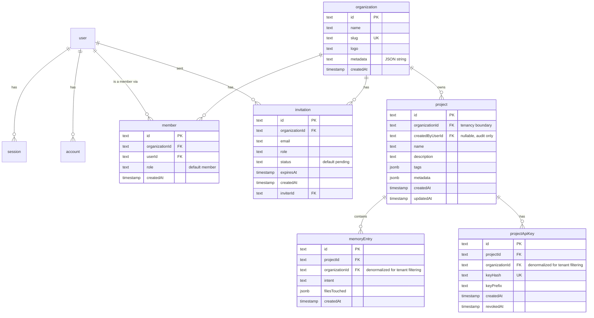

# 02 — Move the database into the backend (+ organization/multi-tenancy schema)

**Status: Done**

Notes from execution:
- `serializeMemoryEntry` was kept as a plain function at the bottom of
  `memory.repository.ts` rather than its own file — it's a 12-line function
  tightly coupled to `memoryEntry`, a separate file added nothing.
- `listProjectsForUser`'s old `ownerName` join (joining `user` on
  `project.userId`) was dropped, not ported — project ownership is now
  organization-based, so "the owner's name" doesn't map 1:1 anymore (a
  project has many members via the org). Whatever the dashboard actually
  wants to show here (creator name? org name? nothing?) is a doc 04/05
  question, not a repository-layer one.
- Verified tenant isolation and FK enforcement directly against the
  Dockerized Postgres inside a rolled-back transaction: a cross-tenant
  query (project A's id + org B's id) returned 0 rows, the correctly-scoped
  query returned 1, and inserting a project under a non-existent
  organization correctly raised a foreign-key violation.

## Goal

`packages/database` stops existing as a separate workspace package. Its
logic moves into `packages/backend`, as the only place that touches
Postgres — but not as a verbatim lift-and-shift. This step also lands the
schema redesign decided mid-migration (see the README's decision table):
real Postgres schema namespaces, and a new organization layer so Trace
becomes multi-tenant (an organization can have many members; projects
belong to an organization, not directly to a user).

## Depends on

Doc 01 (Dockerized Postgres reachable at the backend's `DATABASE_URL`).

## Scope

**In scope:** the new schema (namespaced + org-aware), migrations generated
fresh against it, and the data-access layer (repositories/query functions)
ported and adapted to filter by `organizationId` everywhere multi-tenant
data is touched.

**Out of scope:** actually wiring up better-auth's `organization()` plugin
(doc 03 — that's where the plugin gets configured and its endpoints
mounted; this doc only needs the plugin's *expected tables* to already
exist, matching its schema exactly). Also out of scope: HTTP
controllers/guards that resolve "which organization is this request acting
as" (doc 04) and any frontend organization-switcher UI — deliberately
deferred until the schema + data-access layer is solid.

## Why Postgres schema namespaces

Two real Postgres schemas via Drizzle's `pgSchema()`, instead of one flat
`public` schema:

- **`auth`** — everything better-auth owns: `user`, `session`, `account`,
  `verification`, plus the new `organization`, `member`, `invitation`
  (better-auth's Organization plugin tables) and a new
  `session.active_organization_id` column the plugin requires.
- **`core`** — everything Trace's product logic owns: `project`,
  `memoryEntry`, `projectApiKey`.

This is a real namespace boundary (visible in `\dn`, `\dt auth.*`, `\dt
core.*`), not just a file-organization convention — it makes it
structurally obvious which tables better-auth manages internally (don't
hand-edit) versus which tables are Trace's own domain data.

## Why better-auth's Organization plugin, and its exact schema

better-auth ships an `organization()` plugin with working create-org /
invite / accept-invite / role-check endpoints. Since better-auth is already
moving into this backend (doc 03), adopting its plugin now means the schema
we write today is *exactly* what doc 03 configures later — no adapter
shims, no field-name overrides. Extracted directly from
`better-auth`'s installed plugin source
(`node_modules/better-auth/dist/plugins/organization/organization.mjs`,
teams/dynamic-access-control disabled since we don't need those):

| Table | Field | Type | Notes |
|---|---|---|---|
| `organization` | `id` | text PK | app-generated, no DB default (matches `user`/`session`/etc.) |
| | `name` | text, required | |
| | `slug` | text, required, **unique**, indexed | |
| | `logo` | text, nullable | |
| | `metadata` | text, nullable | better-auth stores this as a **JSON string**, not `jsonb` — don't "fix" this to jsonb, the plugin reads/writes it as a string |
| | `createdAt` | timestamp, required | |
| `member` | `id` | text PK | |
| | `organizationId` | text, required, → `organization.id`, indexed | |
| | `userId` | text, required, → `user.id`, indexed | |
| | `role` | text, required, default `"member"` | |
| | `createdAt` | timestamp, required | |
| `invitation` | `id` | text PK | |
| | `organizationId` | text, required, → `organization.id`, indexed | |
| | `email` | text, required, indexed | |
| | `role` | text, nullable | |
| | `status` | text, required, default `"pending"` | |
| | `expiresAt` | timestamp, required | |
| | `createdAt` | timestamp, required | |
| | `inviterId` | text, required, → `user.id` | |
| `session` (existing table) | `activeOrganizationId` | text, nullable, **no FK** (matches upstream — it's a soft pointer, not enforced) | |

Do not add teams (`team`, `teamMember`) or dynamic access control
(`organizationRole`) tables — out of scope until actually needed; adding
them speculatively means carrying migration/schema weight for a feature
with no consumer yet.

## Why `organizationId` is denormalized onto `memoryEntry` and `projectApiKey`, not just reachable via a `project` join

You asked for "every API/query to filter by organization ID" as a hard
tenant-isolation guarantee. If `memoryEntry`/`projectApiKey` only carried
`projectId`, every org-scoped query would need a join through `project` to
filter safely — easy to forget in a one-off query, which is exactly how
cross-tenant leaks happen. Denormalizing `organizationId` directly onto
both tables means:

- Every repository function can do `where(eq(table.organizationId,
  organizationId))` directly, no join required.
- Composite indexes (`(organizationId, projectId)`,
  `(organizationId, createdAt)`) support both tenant-scoped listing and the
  existing cursor pagination without extra joins.
- It sets up cleanly for Postgres Row-Level Security later, if that's ever
  wanted — RLS policies read straight off a column on the row being
  queried, not through a join.

The tradeoff: `organizationId` must be kept in sync with the parent
`project.organizationId` at write time (projects don't change organization
after creation in this design, so this isn't a moving-target problem — but
call it out in code review if project transfer between orgs ever becomes a
feature).

## Target schema (full picture)



`user`, `session`, `account`, `verification` keep their current shape from
`00-current-state.md`, plus the `session.activeOrganizationId` addition
above.

## Steps

1. Add deps to `packages/backend`: `drizzle-orm`, `pg` (dev: `drizzle-kit`,
   `@types/pg`). Don't add `better-auth` yet — doc 03's job, not needed to
   just define matching tables.
2. `packages/backend/src/database/schema/auth.schema.ts` — `pgSchema("auth")`,
   containing `user`, `session` (+ `activeOrganizationId`), `account`,
   `verification`, `organization`, `member`, `invitation`, and their
   `relations()`.
3. `packages/backend/src/database/schema/core.schema.ts` —
   `pgSchema("core")`, containing `project` (`organizationId`,
   `createdByUserId`, dropping the old direct `userId` ownership field),
   `memoryEntry` (+ `organizationId`), `projectApiKey` (+ `organizationId`),
   and their `relations()`.
4. `packages/backend/src/database/schema/index.ts` re-exporting both.
5. `packages/backend/src/database/crypto-api-key.ts` — ported as-is from
   `packages/database/src/crypto-api-key.ts`.
6. `packages/backend/src/database/database.module.ts` +
   `drizzle.provider.ts` — Nest module providing a `DRIZZLE` injection token
   built from `DATABASE_URL`, mirroring `packages/database/src/db.ts`.
7. Port query helpers as injectable Nest services under
   `packages/backend/src/database/repositories/`, adapted for the new
   shape:
   - `project.repository.ts` — `getOwnedProject(projectId, userId)` becomes
     `getOrgProject(projectId, organizationId)`, checking
     `project.organizationId` instead of `project.userId`.
     `listProjectsForUser(userId)` becomes
     `listProjectsForOrganization(organizationId)`. `insertProject` takes
     `organizationId` + optional `createdByUserId` instead of `userId`.
   - `memory.repository.ts` — every function
     (`insertMemoryEntry`, `listMemoryEntriesForProject`,
     `getMemoryEntryForProject`, `searchMemoryEntriesForProject`) gains an
     `organizationId` parameter and filters on it directly (not just
     `projectId`), per the denormalization rationale above.
   - `api-key.repository.ts` — `resolveActiveApiKeyToProject` now returns
     `{ keyId, projectId, organizationId }` (agent-auth guards in doc 04
     need the org id to scope every subsequent call). `listApiKeysForProject`
     / `createApiKeyForProject` / `revokeProjectApiKey` swap their
     `getOwnedProject(projectId, userId)` ownership check for
     `getOrgProject(projectId, organizationId)`.
   - `serialize-memory.ts` — ported as a plain function, no Nest DI needed.
8. `packages/backend/drizzle.config.ts` pointing `schema` at
   `./src/database/schema/index.ts`, `out` at `./drizzle`.
9. Generate a **fresh** migration history (do *not* port
   `packages/database/drizzle/*.sql` — per the "start fresh" decision in
   doc 01, and because `project`'s shape is changing anyway, carrying
   forward 5 old incremental migrations just to layer a 6th on top adds
   nothing): `pnpm --filter @trace/backend db:generate`, producing one
   clean initial migration that creates both Postgres schemas and every
   table in one shot.
10. Note for cleanup: `packages/database/drizzle/meta/_journal.json`
    (modified) and `.../0005_snapshot.json` (untracked, stray
    `drizzle-kit generate` output never turned into a migration) are
    pre-existing, unrelated to this doc, and `packages/database` itself
    isn't touched by this step — it still backs `apps/web` and
    `packages/trace-mcp` until docs 05/06. Leave those two files alone.
11. Run the fresh migration against the Docker Postgres from doc 01:
    `pnpm --filter @trace/backend db:migrate`.
12. Verify: `\dn` shows `auth` and `core` schemas; `\dt auth.*` and `\dt
    core.*` show the expected tables; a quick script/test inserts an
    organization, a project under it, and a memory entry, then confirms
    `listMemoryEntriesForProject`-style queries correctly filter by
    `organizationId` (i.e., a second organization's data never leaks in).

## Acceptance criteria

- `auth` and `core` Postgres schemas exist with exactly the tables listed
  above — no `team`/`teamMember`/`organizationRole` tables.
- Every repository function that touches `project`, `memoryEntry`, or
  `projectApiKey` takes and filters by `organizationId`.
- `packages/backend` has zero dependency on `@trace/database`.
- `packages/database`'s code is untouched/still present (not yet deleted —
  doc 07's job, after docs 05/06 remove the last consumers).

## Suggested commit message

```
feat(backend): add namespaced Drizzle schema (auth/core) with organization multi-tenancy, ported from @trace/database
```
