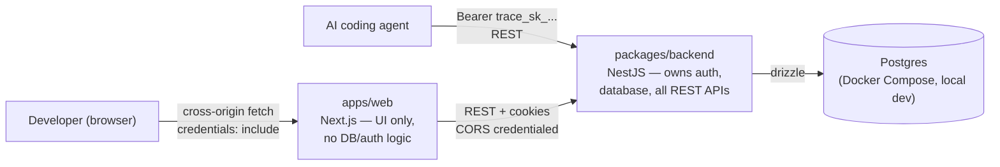

# Trace backend consolidation — migration journey

This folder is the working plan for moving Trace from "Next.js app talking directly
to a shared `@trace/database` package, plus a separate `trace-mcp` MCP server" to
"one NestJS backend that owns auth + database + all REST APIs, with the Next.js
app as a pure API client."

Read this file first, then work through `01`–`07` **in order, one at a time**.
Each numbered doc is sized to be one commit (occasionally two). Don't start
doc `N+1` until `N`'s acceptance criteria pass — later docs assume earlier
ones are done.

## Decisions already locked in (don't relitigate these mid-migration)

| Decision | Choice |
|---|---|
| MCP protocol support | **Superseded by doc 08 — see below.** Originally "removed entirely" (doc 06); revisited after doc 06 shipped and changed to "thin Streamable HTTP endpoint inside `packages/backend`, REST stays too." |
| Auth cookies across frontend/backend | **True cross-origin.** Frontend (`apps/web`, Next.js) and backend (`packages/backend`, Nest) stay on separate origins/ports. Backend sets cookies via CORS with credentials + `SameSite=None; Secure`. No Next.js rewrite/proxy layer. |
| Docker Compose scope | **Postgres only.** `packages/backend/docker-compose.yml` runs just a `postgres` container. Nest and Next both keep running natively via `pnpm`/`turbo dev`. |
| Existing local DB data | **Start fresh.** The Dockerized Postgres starts empty; migrations recreate the schema. Your current native `localhost:5432` data is left alone, not copied in. |
| Schema organization | **Postgres schema namespaces**, not just file grouping. Tables live in two real Postgres schemas via Drizzle's `pgSchema()`: `auth` (user, session, account, verification, organization, member, invitation) and `core` (project, memoryEntry, projectApiKey). Shows up as real namespaces in `\dn`/`\dt`. |
| Organization/multi-tenancy | **better-auth's official Organization plugin**, not hand-rolled tables. Its plugin prescribes an exact schema for `organization`/`member`/`invitation` (see doc 02) plus a `session.activeOrganizationId` column — we match that shape exactly so the plugin (wired in doc 03) works against these tables with zero adapter overrides. |
| Project ownership / tenancy boundary | **Organization-owned.** `project.organizationId` is the tenancy boundary (replaces `project.userId`); `project.createdByUserId` is kept as a nullable audit-only field. `memoryEntry` and `projectApiKey` also get a denormalized `organizationId` (not just via a `project` join) so every query can filter on it directly — see doc 02's rationale. |

These three rows were added mid-migration, after doc 01 was already committed — see doc 02 for the full schema and the reasoning behind the denormalized `organizationId` columns.

## Target architecture (after the migration)

Compare against the current architecture documented from the codebase as of
this plan — see [`00-current-state.md`](./00-current-state.md).

## The journeys

0. [Current state (reference, no changes)](./00-current-state.md)
1. [Workspace + Docker foundations](./01-workspace-and-docker-foundations.md)
2. [Move the database into the backend](./02-database-module-migration.md)
3. [Move auth into the backend](./03-auth-migration.md)
4. [Build the REST API surface](./04-rest-api-surface.md)
5. [Decouple the frontend](./05-frontend-decoupling.md)
6. [Remove trace-mcp](./06-mcp-removal.md) — **partially superseded by doc 08**, see below
7. [Cleanup + verification](./07-cleanup-and-verification.md) — still pending, independent of doc 08
8. [Bring MCP back as a thin Streamable HTTP endpoint](./08-mcp-streamable-http.md)

## Why doc 08 exists — the MCP decision changed after doc 06 shipped

Doc 06 removed MCP entirely, on the original stated decision ("no MCP
adapter, thin or otherwise"). After doc 06 was done, revisiting it surfaced
that the *original* `trace-mcp` (before deletion) already used the correct
transport — **Streamable HTTP** (`StreamableHTTPServerTransport`, a `POST
/mcp` endpoint, Bearer-token auth) — not stdio. The actual objection wasn't
to MCP's transport; it was to `trace-mcp` being a **separate package that
queried Postgres directly**, duplicating the backend's own data-access
logic. Doc 08 brings MCP back the way doc 03's "thin proxy" alternative
originally proposed: as one more transport *inside* `packages/backend`,
calling the exact same repositories/services the REST controllers use — not
a standalone package, and not touching the database on its own. REST stays;
this is additive, not a full reversal.

## Known gap: no organization-onboarding UI

Found while verifying doc 05: a brand-new signup now lands on a dashboard
with **no active organization and no UI anywhere to create one**. The
Organization plugin (doc 03) and the org-scoped guards (doc 04) work
correctly — a session with no active org gets a clean 400 "No active
organization" — but `apps/web` has no "create your first organization" flow,
because that UI never existed before doc 02 introduced organizations. This
isn't caused by, or fixable within, any doc in this folder — it's a genuinely
new feature (backend already supports it: `POST /api/auth/organization/create`
via the Organization plugin) that needs its own scoping and its own doc if/when
you want to tackle it. Until then, new organizations have to be created by a
direct call to that endpoint (or by hand in the database), not through the UI.

## Working agreement

- Each doc has a **Status** line at the top (`Not started` / `In progress` / `Done`).
  Flip it as we go so re-reading this folder cold always shows real progress,
  not just the plan.
- Each doc lists a **suggested commit message** — use it as-is or adapt, but
  keep sub-journeys in separate commits so they're easy to review/revert
  independently.
- If a step turns out to be wrong or a decision above needs to change, edit
  this README's decision table and the affected doc — don't silently drift.
